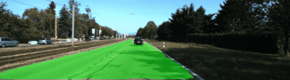
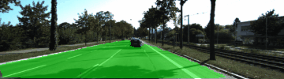

# Semantic Segmentation

I have implemented semantic segmentation [Kitti Road dataset](http://www.cvlibs.net/datasets/kitti/eval_road.php) dataset.

 

### Setup

Make sure you have the following is installed:
 - [Python 3](https://www.python.org/)
 - [TensorFlow](https://www.tensorflow.org/)
 - [NumPy](http://www.numpy.org/)
 - [SciPy](https://www.scipy.org/)

### Usage

##### 1. Download dataset

Download the [Kitti Road dataset](http://www.cvlibs.net/datasets/kitti/eval_road.php) from [here](http://www.cvlibs.net/download.php?file=data_road.zip).  Extract the dataset in the `data` folder.  This will create the folder `data_road` with all the training a test images.

##### 2. Train model

Train fully connected nework model for segmentation using [train.py](https://github.com/penny4860/semantic-segmentation/blob/master/train.py). The training parameter and the path to the model to be saved can be set with argparser.

##### 3. Evaluation trained model

You can use [eval.py](https://github.com/penny4860/semantic-segmentation/blob/master/eval.py) to evaluate the performance of the learned model. eval.py calculates the mean-iou for the road pixel and outputs it.

### Results

Pretrained fcn model is saved at https://drive.google.com/drive/folders/137yefZhrpiJHxq_wPGOmKvv2gjUMvoTM

* mean iou (interaction of union) score: 0.944
* images

