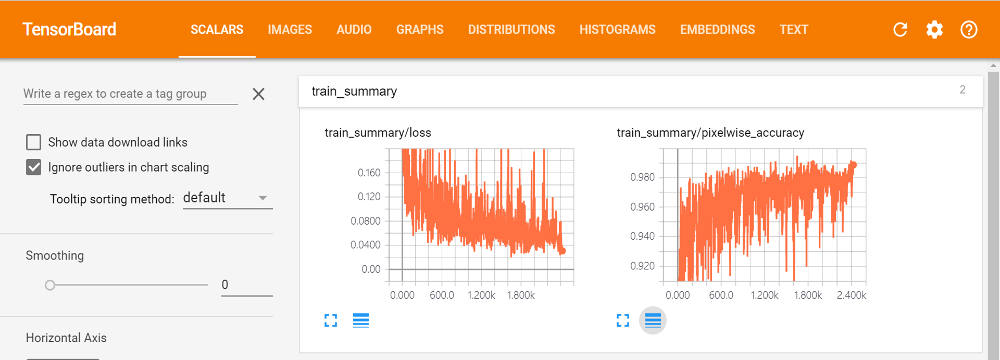
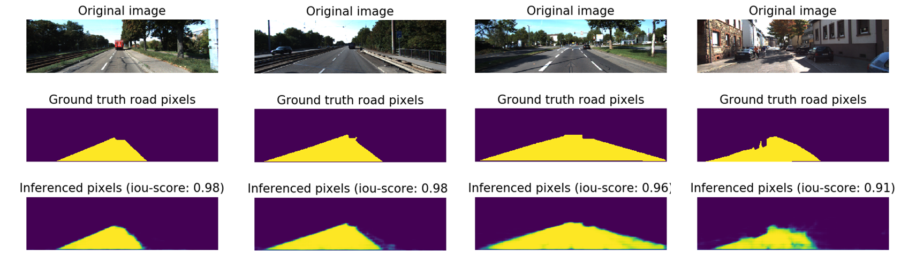

# Semantic Segmentation

I have implemented semantic segmentation using [Kitti Road dataset](http://www.cvlibs.net/datasets/kitti/eval_road.php) dataset.

 

I used the [FCN architecture](https://arxiv.org/pdf/1605.06211.pdf). I removed the dropout layer from the original FCN and added batchnorm to the encoder.

### Setup

Make sure you have the following is installed:
 - [Python 3](https://www.python.org/)
 - [TensorFlow](https://www.tensorflow.org/)
 - [NumPy](http://www.numpy.org/)
 - [SciPy](https://www.scipy.org/)

### Usage

##### 1. Download dataset

Download the [Kitti Road dataset](http://www.cvlibs.net/datasets/kitti/eval_road.php) from [here](http://www.cvlibs.net/download.php?file=data_road.zip).  Extract the dataset in the `data` folder.  This will create the folder `data_road` with all the training a test images.

##### 2. Download pretrained vgg checkpoint file

* Download the vgg16 checkpoint file at https://github.com/tensorflow/models/tree/master/research/slim#pre-trained-models.
* Extract the downloaded file.
* Move the vgg_16.ckpt file to the project/root/data/vgg directory.

##### 3. Train model

Train fully connected nework model for segmentation using [train.py](https://github.com/penny4860/semantic-segmentation/blob/master/train.py). The training parameter and the path to the model to be saved can be set with argparser.

##### 4. Evaluation trained model

You can use [eval.py](https://github.com/penny4860/semantic-segmentation/blob/master/eval.py) to evaluate the performance of the learned model. eval.py calculates the mean-iou for the road pixel and outputs it.

### Results

Pretrained fcn model is saved at [fcn.zip](https://drive.google.com/drive/folders/137yefZhrpiJHxq_wPGOmKvv2gjUMvoTM)

##### 1. Training summary

During training, loss and pixelwise classification accuracy were monitored using a tensorboard.

##### 2. Predicted road pixels

The figure below shows the ground truth road pixel and the pixel predicted by the trained model.

##### 3. Performance evaluation : Mean Intersection over Union (mean-iou)

``mean-iou`` is the standard metric for segmentation purposes. It computes a ratio between the intersection and the union of two sets.

Using [tf.metrics.mean_iou](https://www.tensorflow.org/api_docs/python/tf/metrics/mean_iou), the mean_iou of the trained model is evaluated to be **0.944**.

